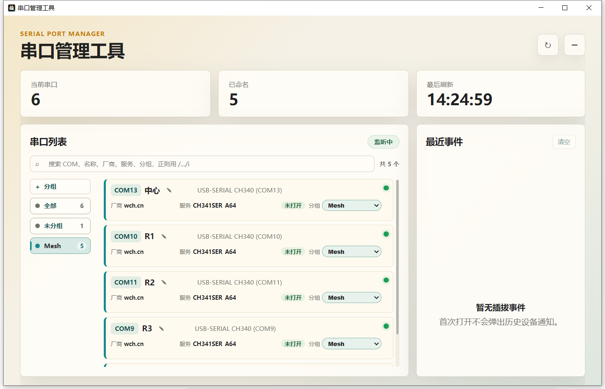

# 串口管理工具

一个面向 Windows 的串口管理和插拔通知工具。打开后可以查看当前所有串口信息，支持自定义名称和自定义分组；最小化或关闭窗口后保留在系统托盘；检测到串口插入或拔出时，会通过系统通知提示具体串口。适合一个 USB Hub 上挂载多个串口设备时快速区分。

## 界面预览



## 功能

- 查看当前串口号、设备名称、厂商、服务和占用状态。
- 串口插入和拔出实时检测。
- 系统通知提示插入或拔出的串口。
- 支持按设备保存自定义名称，重新插拔后仍可识别。
- 支持自定义分组、编辑分组名称和颜色，并将串口加入或移出分组。
- 支持按 COM、名称、厂商、服务、分组搜索串口，正则搜索格式为 `/表达式/flags`，例如 `/COM(7|8)$/`、`/ch341ser/i`。
- 最近事件保留最近 80 条，支持在界面中一键清空。
- 最小化和关闭窗口时隐藏到系统托盘。
- 托盘菜单支持显示窗口、立即刷新和退出。

## 运行

依赖和缓存已经配置在当前 D 盘项目目录内。

```powershell
$env:npm_config_cache="D:\code\serial-manager\.npm-cache"
$env:ELECTRON_CACHE="D:\code\serial-manager\.electron-cache"
npm install
npm start
```

## 开发检查

```powershell
npm run check       # JavaScript 语法检查
npm test            # 配置迁移、原子保存和串口工具单元测试
npm run check:layout # 生成默认窗口和宽屏布局截图
```

布局截图会输出到 `output/layout`，用于快速检查界面是否出现空白、溢出或明显对齐问题。

如需单独检查重命名编辑态布局，可运行：

```powershell
$env:CAPTURE_ALIAS_EDIT="1"
npm run check:layout
```

## 构建

```powershell
$env:ELECTRON_CACHE="D:\code\serial-manager\.electron-cache"
$env:ELECTRON_BUILDER_CACHE="D:\code\serial-manager\.electron-builder-cache"
npm run dist:preview # 生成免安装预览目录
npm run dist:setup   # 生成 Windows 安装包
```

## 工程结构

- `src/main.js` 负责 Electron 应用生命周期和主流程编排。
- `src/main/` 保存主进程侧的配置迁移、原子 JSON 保存、串口扫描、通知内容、事件去重、托盘和窗口逻辑。
- `src/shared/port-filter.js` 保存前端和测试共用的串口搜索逻辑。
- `tests/` 保存 Node.js 单元测试。
- `tools/capture-layout.js` 和 `tools/layout-preload.js` 用于生成带假数据的布局截图。

## 说明

当前版本通过 Windows CIM 查询串口设备信息，不依赖额外串口原生库。配置文件保存在项目的 `data` 目录，方便作为便携工具使用。配置保存采用临时文件覆盖和 `.bak` 备份，读取时会在主文件损坏时回退到备份文件。
